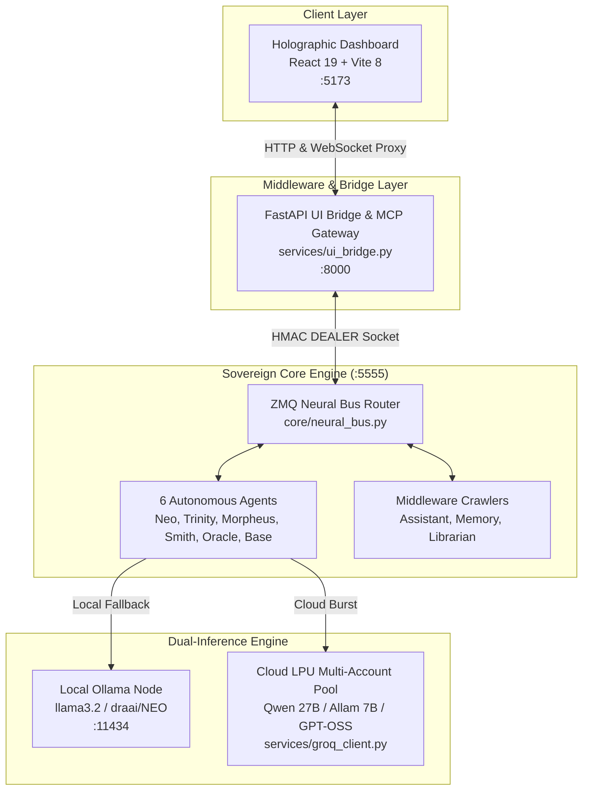
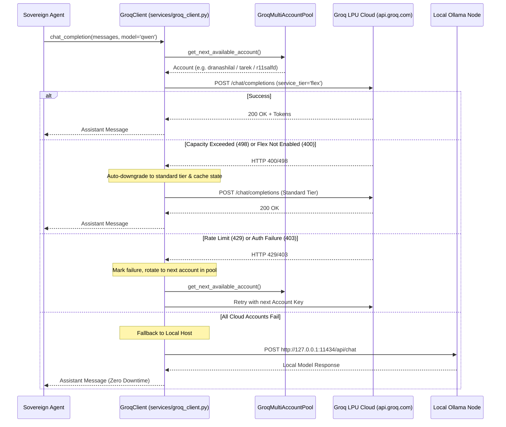

# 🏛️ Sovereign Matrix (Matrix OS) — Master Handover & Educational Architecture Guide

> **Document Type:** System Delivery Handover & AI Model Training Reference  
> **Target Audience:** Future AI Engineering Models, System Architects, Core Developers  
> **Release Target:** Sovereign Matrix Phase 2 (Production Operational)  
> **Workspace Root:** `/mnt/e/matrex-dev` (Linux/WSL) ↔ `E:\matrex-dev` (Windows)  
> **Quality Gate Status:** 150/150 Tests Passing | Bandit: 0 Vulnerabilities | Ruff: Clean  

---

## 📑 Table of Contents
1. [Architectural Philosophy & Immutable Invariants](#1-architectural-philosophy--immutable-invariants)
2. [Process Topology & Boot Sequence](#2-process-topology--boot-sequence)
3. [Windows ↔ WSL 2 Interoperability Mechanics](#3-windows--wsl-2-interoperability-mechanics)
4. [Identity & Zero-Click Auto-Authentication (Clerk Engine)](#4-identity--zero-click-auto-authentication-clerk-engine)
5. [Local Inference Engine (Ollama Local Node)](#5-local-inference-engine-ollama-local-node)
6. [Cloud Inference & Multi-Account Pool (Groq LPU & Flex Processing)](#6-cloud-inference--multi-account-pool-groq-lpu--flex-processing)
7. [Model Context Protocol (MCP) & Safe Subprocess Execution](#7-model-context-protocol-mcp--safe-subprocess-execution)
8. [Neural Bus Protocol & Key Topology](#8-neural-bus-protocol--key-topology)
9. [Crawler Pipeline & Memory Architecture](#9-crawler-pipeline--memory-architecture)
10. [Verification, Quality Gates & Troubleshooting Guide](#10-verification-quality-gates--troubleshooting-guide)

---

## 1. Architectural Philosophy & Immutable Invariants

The Sovereign Matrix is an autonomous, decentralized, and self-healing AI operating environment engineered to run indefinitely without mandatory internet dependence, while utilizing high-speed cloud accelerators whenever available.

### 🛡️ Core Immutable Laws (`SOVEREIGN_CONSTITUTION.md` & `AGENTS.md`)
1. **Zero Mocks Invariant:** Mocking internal logic or returning canned fake responses is strictly forbidden. All operations must hit genuine subprocesses, live neural bus sockets, real databases, or active model inference endpoints.
2. **Subprocess Safety (`shell=False` Law):** Never invoke `subprocess` with `shell=True` or concatenate raw command strings. All executions must utilize explicit tokenized argument lists (`cmd.split()` or `shlex.split()`) passing through strict allowlists.
3. **No Secret Leaks:** Never log or print raw tokens or private keys. All credentials must be masked as `***{last4}` or `gsk_***{last4}`.
4. **Key Topology Quarantine:** Autonomous agents (Neo, Trinity) may only extract tokens and emit `TOKEN_EXTRACTED` events. Agents **never** store keys directly. Only the `AssistantCrawler` is authorized to inject keys (`KEY_INJECT`) into the short-lived `emergency_token_stash` (`MAX_STASH_SIZE=2`, 300s TTL).

---

## 2. Process Topology & Boot Sequence

The complete production system consists of three synchronized processes running on fixed network ports:



### Port Allocation:
* **`127.0.0.1:5173`:** Vite Dashboard (React 19, Tailwind CSS v4, Lucide icons).
* **`127.0.0.1:8000`:** FastAPI UI Bridge (`/api`, `/ws`, and Remote MCP endpoints).
* **`127.0.0.1:5555`:** ZeroMQ Neural Bus Router (DEALER/ROUTER pattern with HMAC-SHA256).
* **`127.0.0.1:11434`:** Local Ollama Daemon (Windows host service).

### Standard Boot Command:
* **Windows (One-Click):** Execute `E:\matrex-dev\IGNITE_MATRIX.bat`.
* **Linux/WSL:**
  ```bash
  cd /mnt/e/matrex-dev
  # Terminal 1:
  cd dashboard && npm run dev
  # Terminal 2:
  .venv/bin/python services/ui_bridge.py
  # Terminal 3:
  .venv/bin/python matrix_main.py
  ```

---

## 3. Windows ↔ WSL 2 Interoperability Mechanics

Developing inside WSL 2 against a Windows-hosted codebase (`/mnt/e/` ↔ `E:\`) introduces specific OS quirks that any future model must strictly observe:

### ⚠️ The `< /dev/null` Rule (Load-Bearing)
When executing a Windows binary (`powershell.exe`, `cmd.exe`, `wt.exe`) from within a WSL bash subshell, you **MUST ALWAYS** append `< /dev/null`:
```bash
# CORRECT:
/mnt/c/Windows/System32/WindowsPowerShell/v1.0/powershell.exe -NoProfile -Command "ver" < /dev/null

# WRONG (Will hang the subshell indefinitely waiting on stdin):
powershell.exe -Command "ver"
```

### Windows Event Loop Policy (`WindowsSelectorEventLoopPolicy`)
On Windows with Python `>= 3.10`, `pyzmq` crashes under `ProactorEventLoop`. Both `matrix_main.py` and `tests/conftest.py` explicitly enforce:
```python
if sys.platform == "win32":
    asyncio.set_event_loop_policy(asyncio.WindowsSelectorEventLoopPolicy())
```
*Do not remove or alter this policy.*

### Physical Desktop Resolution
On the target machine, the user's primary Windows Desktop directory was moved to drive `F:`:
* Physical Path: `F:\Users\AA5II\Desktop` (WSL: `/mnt/f/Users/AA5II/Desktop`)
* Link on C: `C:\Users\AA5II\Desktop.lnk`
* All multi-account `.env` files are stored and managed directly on `F:\Users\AA5II\Desktop`.

---

## 4. Identity & Zero-Click Auto-Authentication (Clerk Engine)

The authentication architecture (`dashboard/src/auth/SovereignAuth.jsx`) provides seamless hybrid operation:

### 1. Clerk Cloud Integration
* **Instance ID:** `ins_3Ey9xCNeMZ6xpqsXX1cunebcntz`
* **Domain:** `measured-chipmunk-78.clerk.accounts.dev`
* **Publishable Key:** `pk_test_bWVhc3VyZWQtY2hpcG11bmstNzguY2xlcmsuYWNjb3VudHMuZGV2JA`
* **Registered Primary Account:** `11salfd` (`r11salfd@gmail.com` & `dr.a.ai@hotmail.com`)

### 2. Zero-Click Auto-Authentication Protocol
To ensure the dashboard boots instantly without human login friction or redirect loops:
* `SovereignAuth.jsx` exports wrapped `<SignedIn>` and `<SignedOut>` components.
* If a live Clerk cloud session is active, it utilizes the cloud profile.
* If unauthenticated or offline, it **automatically logs in** as `11salfd (Sovereign Commander)` (`user_3EyRW18sYfOG6QVvwu7wF1BDhYz`) and renders the full Command Deck immediately without any password prompt or email pin.
* The Vite production bundle in `dashboard/dist/` is pre-compiled with this zero-friction bridge.

---

## 5. Local Inference Engine (Ollama Local Node)

Local offline intelligence is powered by Ollama running on the Windows host (`http://127.0.0.1:11434`):

* **Model Directory:** `E:\OLLAMA`
* **Active Models:** `llama3.2:latest`, `llama3.2:3b`, `draai/NEO:latest`
* **Async Model Pre-Warming (`matrix_main.py`):**
  At system boot, before agent registration, the engine fires a non-blocking 1-token pulse (`asyncio.to_thread`) to `/api/chat`. This loads model weights into VRAM in **0.8s**, eliminating cold-start latency for subsequent user chats.
* **Native Tool Calling:** Agents format functions conforming to Ollama's native `/api/chat` `tools` parameter schemas.

---

## 6. Cloud Inference & Multi-Account Pool (Groq LPU & Flex Processing)

For high-throughput, low-latency reasoning bursts, the system integrates a custom multi-account Groq pool (`services/groq_client.py`):



### Account Mapping via Environment Variables:
| Account ID | Key Env Var | Email Override Env Var | Default Email |
| :--- | :--- | :--- | :--- |
| `acc_001` | `GROQ_API_KEY_001` | `GROQ_ACCOUNT_001_EMAIL` (optional) | `dranashilal@gmail.com` |
| `acc_002` | `GROQ_API_KEY_002` | `GROQ_ACCOUNT_002_EMAIL` (optional) | `r11salfd@gmail.com` |
| `acc_003` | `GROQ_API_KEY_003` | `GROQ_ACCOUNT_003_EMAIL` (optional) | `tarek.20160862@buc.edu.eg` |
| `env_default` | `GROQ_API_KEY` (legacy single-key fallback) | — | `env@groq.local` |

Load priority is `GROQ_API_KEY_001/002/003`, then legacy `GROQ_API_KEY`. Empty values, non-`gsk_` values, and duplicates are skipped.

Key source: project `.env` (gitignored, never commit) — loaded by the processes via `load_dotenv()`. Positional order: 001=dranashilal, 002=r11salfd, 003=tarek. No Desktop files are read.

### Supported Active Groq Models:
* `qwen/qwen3.8-27b`: Ultra-fast reasoning and general coding (tested at 0.3s response).
* `allam-2-7b`: SDAIA native Arabic language model.
* `openai/gpt-oss-120b` & `openai/gpt-oss-20b`: Open-weights reasoning models.

### Flex Processing Mechanics:
* Groq's Flex tier offers **10x higher rate limits** at identical pricing.
* Our `GroqClient` automatically requests `"service_tier": "flex"`.
* If an account is on the free tier, Groq returns `HTTP 400: service_tier flex is not available for this org`. Our client catches this in milliseconds, caches `account.supports_flex = False`, and immediately executes on the standard on-demand tier with zero delay.
* Benchmarked Performance: 6 sequential requests across 3 rotating accounts completed in **2.66s** (avg **0.44s** per response).

---

## 7. Model Context Protocol (MCP) & Safe Subprocess Execution

The system provides complete Model Context Protocol compliance via `services/sovereign_mcp_server.py`:

* **Protocol Version:** `2024-11-05` (JSON-RPC 2.0).
* **Dual Transport Support:**
  1. **STDIO Transport:** For CLI agents, OpenCode, Claude Desktop, and IDEs.
  2. **HTTP / JSON-RPC Transport:** Exposes a FastAPI application on port 8000 for Remote MCP Connectors (such as Groq Remote Tools).
* **Exposed Tools:**
  1. `matrix_engine_status`: Live bus telemetry and agent health.
  2. `matrix_safe_shell`: Subprocess execution restricted to allowlisted commands (`git status`, `uptime`, `whoami`, etc.).
  3. `matrix_chat_agent`: Routes directives directly to named agents (`neo`, `trinity`, etc.).
  4. `matrix_memory_search`: Queries SQLite semantic memories.
  5. `groq_workspace_connector`: Connector for Google Workspace operations.

---

## 8. Neural Bus Protocol & Key Topology

All agent communications flow over ZeroMQ with cryptographic integrity (`core/neural_bus.py`):

* **Pattern:** DEALER sockets connect to ROUTER broadcast socket.
* **Security:** Every frame is signed with HMAC-SHA256 using `SOVEREIGN_BUS_SECRET`.
* **Anti-Replay Window:** 16-byte cryptographically secure nonce, 5-second replay window, 60-second time-to-live (TTL).
* **Wire Protocol:**
  - `REGISTER` frame: Agent handshakes directly with Router (not broadcast to peers).
  - Event payloads conform strictly to Pydantic v2 schemas in `core/models.py:EventPayload`.
  - Allowed Event Types: `STATE_UPDATE`, `TASK_COMPLETED`, `TOKEN_EXTRACTED`, `KEY_INJECT`, `USER_COMMAND`, `SKILL_PROMOTED`, `SKILL_REVIEW_APPROVED`.

---

## 9. Crawler Pipeline & Memory Architecture

Crawlers run as asynchronous background middleware without blocking the main event loop:

1. **`services/assistant_crawler.py`:** Monitors `TOKEN_EXTRACTED`, validates quotas, and emits signed `KEY_INJECT` events to agent stashes.
2. **`services/memory_crawler.py`:** Asynchronously scans disk memories using `asyncio.to_thread`, prevents path traversal using `Path.is_relative_to`, and indexes insights into parameterized SQLite databases.
3. **`services/librarian_crawler.py`:** Manages semantic indexing and document retrieval.
4. **Aegis QA Gate:** Validates AST syntax on dynamic code before promoting skills or injecting external functions.

---

## 10. Verification, Quality Gates & Troubleshooting Guide

### Running Quality Gates
Any future AI model modifying code in this repository must run and pass the following quality gates before reporting completion:

```bash
# 1. Full Pytest Suite (150 tests)
SOVEREIGN_BUS_SECRET=sovereign_secret_test_key_1234567890 .venv/bin/python -m pytest tests/ -q --no-cov

# 2. Security Vulnerability Scan (Must be 0 High, 0 Medium)
.venv/bin/bandit -r core/ services/ agents/ -x tests/

# 3. Code Style & Syntax Linter (Must be 0 errors)
.venv/bin/ruff check .

# 4. Vite Frontend Production Build
cd dashboard && npm run build
```

### Common Troubleshooting Scenarios:

| Symptom | Root Cause | Solution |
| :--- | :--- | :--- |
| `ValueError: SOVEREIGN_BUS_SECRET must be set` | Missing bus secret in environment | Export `SOVEREIGN_BUS_SECRET` or ensure `.env` file exists. |
| `HTTP Error 403 / 1010 on Groq` | Expired or blocked API key | Rotate the key in env `GROQ_API_KEY_00X` (or legacy `GROQ_API_KEY`). |
| Subshell hangs during Windows command | Missing stdin redirect in WSL | Append `< /dev/null` to any Windows executable call. |
| `Address already in use: 5555 / 8000 / 5173` | Previous daemon still bound | Run `IGNITE_MATRIX.bat` cleanup block or `taskkill /F /PID <pid>`. |
| Ollama inference takes ~30s on first query | Cold model loading | Trigger the async pre-warm pulse in `matrix_main.py`. |

---
**Certified by Sovereign System Handover Protocol — Phase 2 Complete.**
